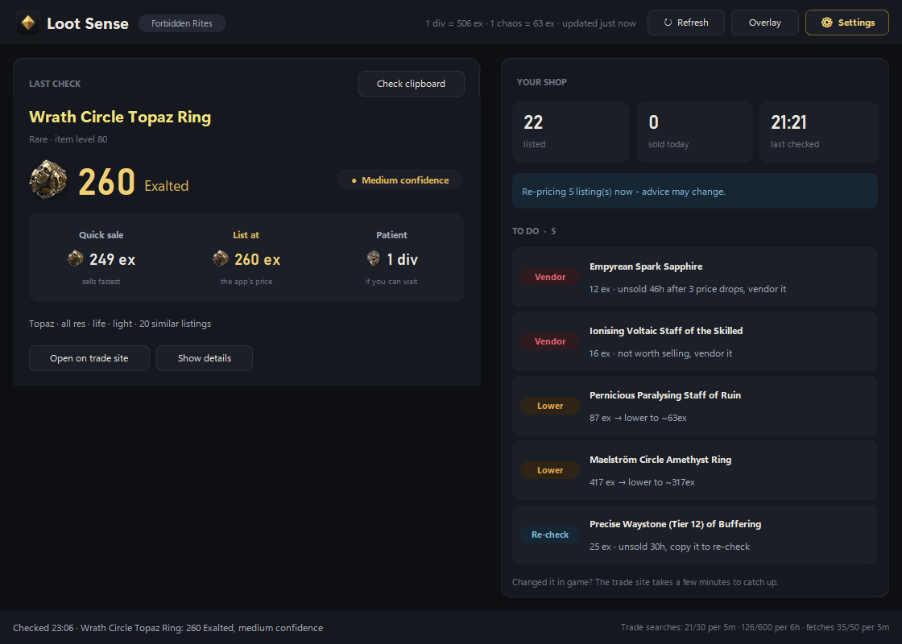
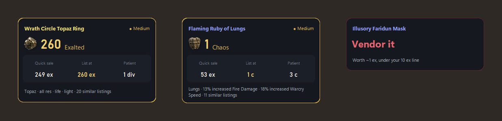

  

<h1 align="center">Loot Sense</h1>

  A price checker for <b>Path of Exile 2</b>: copy an item, see what it's worth. 
  <a href="../../releases/latest"><b>Download the latest version</b></a>
  &nbsp;·&nbsp;
  <a href="https://ko-fi.com/jet777">Support it on Ko-fi</a>

  

## What it does

Loot Sense doesn't just look a price up - it tells you what to do with the item:
**vendor it**, **list it at this**, or **wait for that**, in the currency people
actually trade it in.

- **Prices items on Ctrl+C.** A small overlay shows what an item is worth right
  in game: a quick-sale price, the price to list at, and a patient price, with
  how sure it is. Junk just says **Vendor it**.
- **Watches your shop.** It checks your trade listings and tells you what to
  vendor, lower, raise or re-check.
- **Keeps your loot filter up to date.** NeverSink's very strict filter with live
  prices on top, rebuilt every 30 minutes.
- **Knows currency.** Orbs, runes, essences and the like are priced at the
  in-game exchange rate.

  

## Install

1. Download **LootSense-Setup** from **[Releases](../../releases/latest)** and run it.
2. Windows may say *"Windows protected your PC"*. Click **More info → Run anyway**
   (Loot Sense isn't code-signed: signing certificates cost money).
3. Loot Sense starts when setup finishes. Next time, find it in the Start menu
   or on your desktop.

To update, run the new setup: it closes Loot Sense, updates it and keeps your
settings.

**Rather not install?** Download the **portable** zip instead, unzip it
anywhere and double-click **Loot Sense.exe**.

Closing the window keeps Loot Sense running in the tray (next to the clock).
Right-click the tray icon and choose **Exit** to quit.

Loot Sense tells you when a new version is out.

## Using it

| In game | What happens |
|---|---|
| Hover an item, press **Ctrl+C** | The overlay prices it (it never takes focus from the game) |
| Keep pressing Ctrl+C through your stash | Each new item replaces the last one |
| **Ctrl+Shift+L** | Brings the overlay back after it fades |
| Drag the overlay | Moves it; it remembers where you put it |
| Double-click the overlay | Opens the main window |

**Your shop:** press Ctrl+C once on one of your own listed items (one with a
price note). Loot Sense then finds your listings by itself and checks them
regularly.

**Loot filter:** follow NeverSink's **4-Very-Strict** filter on pathofexile.com
(Item Filters) first, then pick **LootSense-NeverSink** in the game's options.
Until then, **LootSense** works on its own. The files live in
`Documents\My Games\Path of Exile 2`.

## FAQ

**Is it safe to use?**
Loot Sense only reads your clipboard and the public trade site, the same way
your browser does. It never touches the game's files or memory, never logs in
to your account, and never lists, buys or sells anything. It stays inside the
trade site's request limits.

**Why do some prices say "low confidence"?**
The market for that item is thin or all over the place. Treat the number as a
range and have a look on the trade site before selling cheap.

**It says I hit the trade limit.**
The trade site allows only a few searches a minute. Checking lots of items
quickly fills that up; Loot Sense waits it out and carries on.

**Does it work with Path of Exile 1?**
No, Path of Exile 2 only.

**Where are my settings? How do I uninstall?**
Everything Loot Sense remembers is in `C:\Users\<you>\.loot_sense`. If you
turn on the daily backup in Settings, the last 7 copies are also kept in
`OneDrive\LootSense backups` (or `Documents\LootSense backups`). To uninstall,
go to Windows **Settings → Apps → Installed apps → Loot Sense → Uninstall**
(for the portable version, delete its folder). Uninstalling keeps your
settings; to remove everything, also delete the `.loot_sense` folder and any
backups.

**What does it connect to?**
Only the Path of Exile website (the trade site), poe.ninja and poe2scout (for
prices), and this page to see if there's a new version.
No tracking, no ads, no accounts. It only looks at copied text that is a Path
of Exile item; anything else you copy is ignored.

**How do I know my download is the real one?**
Download only from this page. Each release lists a SHA-256 checksum: in
PowerShell, `Get-FileHash` on the file you downloaded (for example
`Get-FileHash LootSense-Setup-1.2.0.exe`) should print the same one.

**Is it free?**
Yes, completely: no ads, no premium version, no account. If it saves you some
currency and you'd like to say thanks, there's a Ko-fi link below.

## Support

Loot Sense is free and made in my spare time. If it's been useful, you can
buy me a coffee - it keeps the updates coming.

Found a bug or have an idea? [Open an issue](../../issues/new/choose).

## License

Free to use. Please don't re-upload, sell or rebrand it. Share the link to this
page instead. See [LICENSE.txt](LICENSE.txt).

Not affiliated with or endorsed by Grinding Gear Games.
